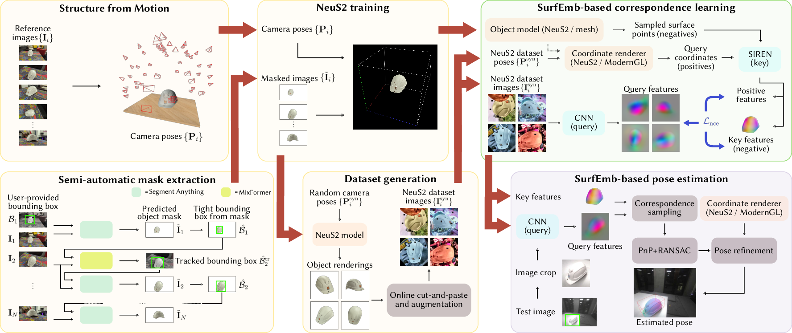

<h1 align="center">NeuSurfEmb: A Complete Pipeline for Dense Correspondence-based 6D Object Pose Estimation without CAD Models</h1>
<p align="center">
<strong><a href="https://scholar.google.com/citations?user=qwSANZoAAAAJ&hl=en&oi=ao">Francesco Milano</a></strong>, <strong><a href="https://jenjenchung.github.io/anthropomorphic/">Jen Jen Chung</a></strong>, <strong><a href="https://hermannblum.net/">Hermann Blum</a></strong>, <strong><a href="https://asl.ethz.ch/">Roland Siegwart</a></strong>, <strong><a href="http://ott.ai/">Lionel Ott</a></strong>
</p>

<h2 align="center">IROS 2024</h2>
<h3 align="center"><a href="https://arxiv.org/abs/2407.12207">Paper</a></h3>

<p align="center">
  <a href="">
    
  </a>
</p>

State-of-the-art approaches for 6D object pose estimation assume the availability of CAD models and require the user to manually set up physically-based rendering (PBR) pipelines for synthetic training data generation. Both factors limit the application of these methods in real-world scenarios. In this work, we present a pipeline that does not require CAD models and allows training a state-of-the-art pose estimator requiring only a small set of real images as input. Our method is based on a NeuS2 object representation, that we learn through a semi-automated procedure based on Structure-from-Motion (SfM) and object-agnostic segmentation. We exploit the novel-view synthesis ability of NeuS2 and simple _cut-and-paste_ augmentation to automatically generate photorealistic object renderings, which we use to train the correspondence-based SurfEmb pose estimator. We evaluate our method on the LINEMOD-Occlusion dataset, extensively studying the impact of its individual components and showing competitive performance with respect to approaches based on CAD models and PBR data. We additionally demonstrate the ease of use and effectiveness of our pipeline on self-collected real-world objects, showing that our method outperforms state-of-the-art CAD-model-free approaches, with better accuracy and robustness to mild occlusions.

## Table of contents

1. [Installation](#installation)
2. [Training](#training)
    - [Data recording and extraction](#data-recording-and-extraction-skip-for-bop-datasets)
    - [Structure from Motion](#structure-from-motion-skip-for-bop-datasets)
    - [Semi-automatic mask extraction](#semi-automatic-mask-extraction-skip-for-bop-datasets)
    - [NeuS2 training and data generation](#neus2-training-and-data-generation)
    - [SurfEmb training](#surfemb-training)
    - [[Optional] YOLOv8 training](#optional-yolov8-training)
    - [Example pipeline training](#example-pipeline-training)
3. [Evaluation on BOP](#evaluation-on-bop)
4. [Evaluation on real-world datasets](#evaluation-on-real-world-datasets)
5. [Citation](#citation)
6. [Acknowledgements](#acknowledgements)

## Installation
Please refer to [this page](./docs/install.md) for the installation steps.


## Training
In the following, we assume that a virtualenv was created in the folder `${NEUSURFEMB_VIRTUALENV}` according to the installation instructions above, and that the virtualenv was sourced (_i.e._, the command `source ${NEUSURFEMB_VIRTUALENV}/bin/activate` was run).

The instructions below will show how to use NeuS2 to build a neural implicit object model and generate a dataset (yellow boxes in the teaser figure), train the SurfEmb pose estimator using the generated data (green boxes in the teaser figure), and run pose estimation using the trained model (purple box in the teaser figure). Follow all the steps to use the pipeline for a new, real-world object; to instead train a model for objects in the LINEMOD dataset, skip the "Data recording and extraction", "Structure from Motion", and "Semi-automatic mask extraction" steps (since camera poses and object masks are available in BOP datasets).

Cf. the Section [Example pipeline training](#example-pipeline-training) for an example run of the pipeline in a single script, using example data provided for download.

### Data recording and extraction [skip for BOP datasets]
It is expected that for a new, real-world object, around 100 images of the object of interest are available. The images should be of high quality (_e.g._, high resolution and no motion blur) and be captured from viewpoints distributed roughly uniformly around the object, so as to cover all sides of the object except for its bottom part. The object should always be visible and not occluded in the frames, and we strongly recommend including some high-texture elements (for instance, a carpet with non-symmetrical patterns) around or below the object of interest; this is important to improve the convergence of the SfM module, especially for symmetrical and low-texture objects.

The frames can be extracted from a video recorded with a smartphone, similarly to what we did in our real-world experiments. We suggest moving the smartphone slowly to avoid motion blur.
The SfM module (cf. [next Section](#structure-from-motion-sfm-skip-for-bop-datasets)) can either process raw, uncalibrated images, or take as input undistorted images from an already calibrated camera. Depending on which option you choose, you may either:
- Manually create a dataset folder `${DATASET_FOLDER}` and extract approximately 100 frames into a `${DATASET_FOLDER}/raw_rgb` subfolder, in case you would like to use the SfM module with uncalibrated images, _or_
- (Recommended) Follow [these instructions](./docs/camera_calibration_and_data_extraction_from_video.md) to calibrate the camera and extract the undistorted frames, in case you would like to use the SfM module with undistorted images as input.

Since SfM motion is inherently scale ambiguous, the reconstructed NeuS2 model (and consequently the estimated poses) will be in an arbitrary scale when using only RGB images as input. To retrieve the scene scale in meters and use it to reconstruct the NeuS2 model and estimate poses in meters, you may optionally provide an additional `${DATASET_FOLDER}/raw_depth` subfolder containing depth images aligned to the RGB frames. If these are available, the SfM module will automatically convert the scene scale to meters using the depth frames.

### Structure from Motion [skip for BOP datasets]

Given the dataset folder described, Structure-from-Motion based on COLMAP and [`hloc`](https://github.com/cvg/Hierarchical-Localization), is used to retrieve camera poses to later train a NeuS2 object model.

<details>
<summary>SfM using camera calibration and pre-undistorted images (recommended)</summary>

Assuming that you have previously run camera calibration and undistorted the input frames (cf. above), run the [`pose_labeling_given_intrinsics.py`](./neusurfemb/dataset_scripts/pose_labeling_given_intrinsics.py) script:
```bash
python ${NEUSURFEMB_ROOT}/neusurfemb/dataset_scripts/pose_labeling_given_intrinsics.py ${DATASET_FOLDER};
```
<details>
<summary>Docker version:</summary>

```bash
${NEUSURFEMB_ROOT}/docker/run_docker.sh -d ${SHARED_HOST_FOLDER} python /home/src/neusurfemb/neusurfemb/dataset_scripts/pose_labeling_given_intrinsics.py ${DATASET_FOLDER};
```
</details>
</details>
<details>
<summary>SfM from raw images</summary>

Use the [`pose_labeling.py`](./neusurfemb/dataset_scripts/pose_labeling.py) script:
```bash
python ${NEUSURFEMB_ROOT}/neusurfemb/dataset_scripts/pose_labeling.py ${DATASET_FOLDER};
```
<details>
<summary>Docker version:</summary>

```bash
${NEUSURFEMB_ROOT}/docker/run_docker.sh -d ${SHARED_HOST_FOLDER} python /home/src/neusurfemb/neusurfemb/dataset_scripts/pose_labeling.py ${DATASET_FOLDER};
```
</details>
</details>


### Semi-automatic mask extraction [skip for BOP datasets]
We use a `SAM`-based solution to extract the object masks from the dataset:
```bash
python ${NEUSURFEMB_ROOT}/neusurfemb/dataset_scripts/extract_object_masks_bbox.py --dataset-folder ${DATASET_FOLDER}
```
<details>
<summary>Docker version</summary>

```bash
${NEUSURFEMB_ROOT}/docker/run_docker.sh -d ${SHARED_HOST_FOLDER} -- python /home/src/neusurfemb/neusurfemb/dataset_scripts/extract_object_masks_bbox.py --dataset-folder ${DATASET_FOLDER}
```
</details>

The script will prompt the user to select a bounding box around the object in the first image. It can also be used without GUI interaction by providing the argument `--bbox-prompt`, indicating the coordinates of the bounding box around the object in the first image in the `x_min y_min x_max y_max` format (_e.g._, `--bbox-prompt 100 200 600 500`).

We recommend checking the output masks extracted for each frame (which are stored as alpha channel of the images in `${DATASET_FOLDER}/rgb`), as for complex objects a single bounding-box prompt might not be sufficient for accurate segmentation via SAM, or the tracker performance might be occasionally suboptimal.
We provide a set of scripts to perform more fine-grained mask extraction, if needed:
<ul>
<li>
<details>
<summary>To re-extract masks from a specific frame using a single bounding box prompt, use the script <a href="./neusurfemb/dataset_scripts/extract_object_masks_single_frames_bbox.py"><tt>extract_object_masks_single_frames_bbox.py</tt></a></summary>

```bash
python ${NEUSURFEMB_ROOT}/neusurfemb/dataset_scripts/extract_object_masks_single_frames_bbox.py --image-path ${IMAGE_PATH};
```
where `${IMAGE_PATH}` is the path of the image of which to recompute the mask.

<i>Example</i>: `python ${NEUSURFEMB_ROOT}/neusurfemb/dataset_scripts/extract_object_masks_single_frames_bbox.py --image-path ${DATASET_FOLDER}/rgb/000000.png`.
</details>
</li>
<li>
<details>
<summary>To re-extract masks from a specific frame using one or multiple point prompts, use the script <a href="./neusurfemb/dataset_scripts/extract_object_masks_single_frames.py"><tt>extract_object_masks_single_frames.py</tt></a></summary>

```bash
python ${NEUSURFEMB_ROOT}/neusurfemb/dataset_scripts/extract_object_masks_single_frames.py --image-path ${IMAGE_PATH};
```
where `${IMAGE_PATH}` is the path of the image of which to recompute the mask.

<i>Example</i>: `python ${NEUSURFEMB_ROOT}/neusurfemb/dataset_scripts/extract_object_masks_single_frames.py --image-path ${DATASET_FOLDER}/rgb/000000.png`.
</details>
</li>
<li>
<details>
<summary>To extract masks with manual bounding box prompts (one or multiple) for all the frames in a folder (<i>i.e.</i>, without using the tracker), use the script <a href="./neusurfemb/dataset_scripts/extract_object_masks_bbox_continuous_prompt.py"><tt>extract_object_masks_bbox_continuous_prompt.py</tt></a></summary>

```bash
python ${NEUSURFEMB_ROOT}/neusurfemb/dataset_scripts/extract_object_masks_bbox_continuous_prompt.py --dataset-folder ${DATASET_FOLDER};
```
where `${DATASET_FOLDER}` is the path of the dataset folder, which should contain an `rgb` subfolder with mask-free images (_i.e._, as it was before mask extraction). To optionally have multiple bounding box prompts per image, use the `--num-bboxes-per-image` flag.

<i>Example</i>: `python ${NEUSURFEMB_ROOT}/neusurfemb/dataset_scripts/extract_object_masks_bbox_continuous_prompt.py --dataset-folder ${DATASET_FOLDER} --num-bboxes-per-image 2`.
</details>
</li>
</ul>

### NeuS2 training and data generation
#### Format the data for NeuS training
##### Own, real-world objects
For a real, self-captured object dataset (see above), use the script [`real_dataset_to_neus.py`](./neusurfemb/dataset_scripts/real_dataset_to_neus.py) to prepare the data for NeuS2 training:
```bash
python ${NEUSURFEMB_ROOT}/neusurfemb/dataset_scripts/real_dataset_to_neus.py --dataset-folder ${DATASET_FOLDER};
```
<details>
<summary>Docker version</summary>

```bash
${NEUSURFEMB_ROOT}/docker/run_docker.sh -d ${SHARED_HOST_FOLDER} -- python /home/src/neusurfemb/neusurfemb/dataset_scripts/real_dataset_to_neus.py --dataset-folder ${DATASET_FOLDER};
```
</details>

##### BOP datasets
For an existing BOP dataset, follow the instructions below.

To begin with, download the BOP data in a folder `${BOP_FOLDER}` of your choice. In the following, we show the instructions for LINEMOD:
```bash
cd ${BOP_FOLDER};
# Download the base archive and the object models (only used for evaluation).
wget https://bop.felk.cvut.cz/media/data/bop_datasets/lm_base.zip;
unzip -q lm_base.zip && rm lm_base.zip;
cd ${BOP_FOLDER}/lm;
wget https://bop.felk.cvut.cz/media/data/bop_datasets/lm_models.zip;
unzip -q lm_models.zip && rm lm_models.zip;
# Download the images. For LINEMOD, we use the BOP'19-23 test images to form the
# models. We then assume that evaluation is performed on LINEMOD-Occlusion
# instead.
cd ${BOP_FOLDER}/lm;
wget https://bop.felk.cvut.cz/media/data/bop_datasets/lm_test_bop19.zip;
unzip -q lm_test_bop19.zip && rm lm_test_bop19.zip;
```

Use the script [`bop_dataset_to_neus.py`](./neusurfemb/dataset_scripts/bop_dataset_to_neus.py) to format the data for NeuS training:
```bash
# Example for scene 1.
python ${NEUSURFEMB_ROOT}/neusurfemb/dataset_scripts/bop_dataset_to_neus.py --scene-path ${BOP_SCENE_FOLDER}/lm/test/000001 --obj-id-to-process 1
```

#### [Optional] Normalize object to a specific scale
To allow the quality of the NeuS-based object reconstruction to be less dependent on the object size (avoiding, _e.g._, that smaller objects get reconstructed with a lower level of detail), we recommend normalizing the size of each object to a fixed extent of the full 3D bound used by NeuS. To do so, we run a two-step training process. In particular, before the actual training, we train NeuS with the transform file formed as detailed above. We then extract a point cloud from the reconstruction, compute the object size from the point cloud, and use this to normalize the poses, so that a subsequent NeuS training yields an object size approximately equal to the desired one, which is defined by the parameter `${BOUND_EXTENT}` (between 0 and 1). We find `BOUND_EXTENT=0.55` to achieve the best trade off between reconstruction quality (evaluated on LINEMOD as average Chamfer distance w.r.t. the ground-truth models) and reconstruction density.

You may use the [`adapt_dataset_scale.py`](./neusurfemb/dataset_scripts/adapt_dataset_scale.py) script to perform this conversion. A new version of the dataset will be created in a `new_dataset` subfolder (cf. below):
```bash
BOUND_EXTENT=0.55;
python ${NEUSURFEMB_ROOT}/neusurfemb/dataset_scripts/adapt_dataset_scale.py --scene-transform-path ${DATASET_FOLDER}/transforms.json --name bound_${BOUND_EXTENT} --n-steps 4000 --should-convert-to-mm --bound-extent ${BOUND_EXTENT};
export DATASET_FOLDER=${DATASET_FOLDER}/neus_rescaling/bound_${BOUND_EXTENT}/new_dataset;
```
<details>
<summary>Docker version</summary>

```bash
BOUND_EXTENT=0.55;
${NEUSURFEMB_ROOT}/docker/run_docker.sh -d ${SHARED_HOST_FOLDER} -- python /home/src/neusurfemb/neusurfemb/dataset_scripts/adapt_dataset_scale.py --scene-transform-path ${DATASET_FOLDER}/transforms.json --name bound_${BOUND_EXTENT} --n-steps 4000 --should-convert-to-mm --bound-extent ${BOUND_EXTENT};
export DATASET_FOLDER=${DATASET_FOLDER}/neus_rescaling/bound_${BOUND_EXTENT}/new_dataset;
```
</details>

#### NeuS2 training
To train NeuS2 and generate data, run the following script:
```bash
python ${NEUSURFEMB_ROOT}/training_scripts/train_neus.py ${DATASET_FOLDER} --workspace ${EXPERIMENT_FOLDER} --num-iters ${NUM_TRAIN_ITERS} --compute-oriented-bounding-box ${COMPUTE_ORIENTED_BBOX}
```
where `${EXPERIMENT_FOLDER}` is the path to the output folder that will contain the trained model as well as the generated data, `${NUM_TRAIN_ITERS}` is the number of NeuS2 training iterations (we find `6000` to usually yield a good reconstruction and `20000` to improve results for more complex objects), `${COMPUTE_ORIENTED_BBOX}` should be `true` if the object coordinate system should be adjusted to be aligned with an oriented bounding box and `false` otherwise. This alignment is used to define camera poses when generating data, to avoid for instance that camera poses that look at the object from the bottom are used. We recommend setting it to `true` for real objects labelled with `dataset_scripts/pose_labeling.py` and to `false` for BOP datasets, the latter because the coordinate system of these datasets is already properly aligned.

The training data can be cropped and resized to a fixed size and coordinates can be generated for each frame. This enables using these data also for training the pose estimation pipeline. To do so, also specify the flags `--crop-res-train-dataset` and `--crop-scale-factor-train-dataset` with associated values when running the above script. The two flags represent respectively the resolution of the rendered crop and the factor by which the object-tight bounding boxes used to crop the images are enlarged. For instance, for resolution of `224x224` based on a crop that is tight to the object boundaries, use the flags `--crop-res-train-dataset 224 --crop-scale-factor-train-dataset 1.0`.

To generate synthetic data, also specify the flag `--synthetic-data-config-path` followed by a path to a valid config file when running the above script (_e.g._, `--synthetic-data-config-path ${NEUSURFEMB_ROOT}/cfg/syn_data_generation/config_10000_views.yml`).

<details>
<summary>Docker version (example with synthetic data generation)</summary>

```bash
EXPERIMENT_FOLDER=${DATASET_FOLDER}/training;
NUM_TRAIN_ITERS=20000;
COMPUTE_ORIENTED_BBOX=true;
${NEUSURFEMB_ROOT}/docker/run_docker.sh -d ${SHARED_HOST_FOLDER} -- python /home/src/neusurfemb/training_scripts/train_neus.py ${DATASET_FOLDER} --workspace ${EXPERIMENT_FOLDER} --num-iters ${NUM_TRAIN_ITERS} --compute-oriented-bounding-box ${COMPUTE_ORIENTED_BBOX} --synthetic-data-config-path /home/src/neusurfemb/cfg/syn_data_generation/config_10000_views.yml;
```
</details>

### SurfEmb training
We implement different configurations for training SurfEmb, depending on the renderer, object model and data used:

|      | Coordinate renderer | Object model                                |  Data                      |  Comments                                                 |
| ---: | :----:              |    :----:                                   |    :----:                  |                                                      ---: |
| 1.   | Neus2               | Point cloud from mesh generated using NeuS2 | Data generated using NeuS2 | -                                                         |
| 2.   | ModernGL renderer   | Point cloud from mesh generated using NeuS2 | Data generated using NeuS2 | -                                                         |
| 3.   | ModernGL renderer   | Point cloud from CAD model                  | Data generated using NeuS2 | Only available for (BOP) datasets                         |
| 4.   | ModernGL renderer   | Point cloud from CAD model                  | PBR data                   | Only available for (BOP) datasets, original SurfEmb setup |
| 5.   | ModernGL renderer   | Point cloud from mesh generated using NeuS2 | PBR data                   | Only available for (BOP) datasets                         |

Before starting SurfEmb training, create a symbolic link to the data produced by NeuS2:
```bash
mkdir -p ${NEUSURFEMB_ROOT}/third_party/surfemb/data/bop;
cd ${NEUSURFEMB_ROOT}/third_party/surfemb;
export EXPERIMENT_BASE_NAME=$(basename ${EXPERIMENT_FOLDER});
ln -s ${EXPERIMENT_FOLDER}/data_for_surfemb/ data/bop/${EXPERIMENT_BASE_NAME};
ln -s ${EXPERIMENT_FOLDER}/data_for_surfemb/surface_samples/ data/surface_samples/${EXPERIMENT_BASE_NAME};
ln -s ${EXPERIMENT_FOLDER}/data_for_surfemb/surface_samples_normals/ data/surface_samples_normals/${EXPERIMENT_BASE_NAME};
```
Optionally, disable WandB logging before starting training: `export WANDB_MODE=disabled`.

Then proceed with one of the Options 1-5 below. Note that for new, real-world objects, only Options 1-2 are viable. _Important_: For a correct folder setup when using the Docker installation, cf. Step 8 in the example script [`example_pipeline_run.sh`](./example_pipeline_run.sh).
- <details><summary>Additional pre-requisites for training on BOP datasets </summary>

    Set up the paths correctly and download the inference data from SurfEmb, also later required for evaluation:
    ```bash
    cd ${NEUSURFEMB_ROOT}/third_party/surfemb/data/bop;
    # Assuming in the instructions above the LINEMOD dataset was downloaded.
    ln -s ${BOP_SCENE_FOLDER}/lm lm;
    # Download the inference data.
    # - Create a temporary folder if non-existent.
    if [ -z ${TMPDIR+x} ]; then
        export TMPDIR=$(mktemp -d);
    fi;
    # - Download the data.
    pushd $TMPDIR;
    wget https://github.com/rasmushaugaard/surfemb/releases/download/v0.0.1/inference_data.zip;
    unzip -q inference_data.zip && rm inference_data.zip;
    mv data/detection_results $NEUSURFEMB_ROOT/third_party/surfemb/data/;
    mv data/surface_samples/* $NEUSURFEMB_ROOT/third_party/surfemb/data/surface_samples/;
    mv data/surface_samples_normals/* $NEUSURFEMB_ROOT/third_party/surfemb/data/surface_samples_normals/;
    popd;
    ```
    </details>
- <details>
    <summary><b>Option 1: Use NeuS2 renderer with object model generated using Neus2 and data generated using NeuS2</b></summary>

    Run SurfEmb training, specifying the flags `--neus2-dataset` and `--renderer-type neus2_offline`:
    ```bash
    cd ${NEUSURFEMB_ROOT}/third_party/surfemb;
    python -m surfemb.scripts.train ${EXPERIMENT_BASE_NAME} --gpus 0 --neus2-dataset --renderer-type neus2_offline;
    ```
    This type of training will read pre-computed coordinate maps, properly adjusting them to account for data augmentation, but will not render new coordinate maps online.

    To render new coordinate maps online (slower and effectively equivalent to offline at the moment because no new poses are used), use instead the flag `--renderer-type neus2_online`, along with the `--neus2-checkpoint-folders` flag indicating the path to the pre-trained NeuS2 model:
    ```bash
    cd ${NEUSURFEMB_ROOT}/third_party/surfemb;
    python -m surfemb.scripts.train ${EXPERIMENT_BASE_NAME} --gpus 0 --neus2-dataset --renderer-type neus2_online --neus2-checkpoint-folders ${EXPERIMENT_FOLDER}/checkpoints;
    ```
    </details>
- <details>
    <summary><b>Option 2: Use ModernGL renderer with object model generated using Neus2 and data generated using NeuS2</b></summary>

    Run SurfEmb training, specifying the flags `--neus2-dataset` and `--renderer-type moderngl`:
    ```bash
    cd ${NEUSURFEMB_ROOT}/third_party/surfemb;
    python -m surfemb.scripts.train ${EXPERIMENT_BASE_NAME} --gpus 0 --neus2-dataset --renderer-type moderngl;
    ```
    Include the flag `--real` if the real, converted training-image dataset should be used instead of the synthetically generated images (for debug or testing only).
    </details>
- <details>
    <summary><b>Option 3: Use ModernGL renderer with object CAD model and data generated using NeuS2 [(BOP) datasets only]</b></summary>

    Use the same commands as Option 2, but replace the folders `models`, `surface_samples`, and `surface_samples_normals` in `${EXPERIMENT_FOLDER}/data_for_surfemb` with the corresponding ones in the BOP dataset folder (e.g., `${BOP_FOLDER}/lm`, if using LINEMOD as described above). **Important**: Only the object models for the object of interest should be used when replacing, otherwise the instantiated network will contain a decoder for each object found! In practice, to train for instance on object `000001`, the folder `${EXPERIMENT_FOLDER}/data_for_surfemb/models` should only contain only a `models_info.json` and an `obj_000001.ply` file, and the folders `${EXPERIMENT_FOLDER}/data_for_surfemb/surface_samples` and `{EXPERIMENT_FOLDER}/data_for_surfemb/surface_samples_normals` and should contain only a `obj_000001.ply` file.
    </details>
- <details>
    <summary><b>Option 4: Use ModernGL renderer with object CAD model and PBR data [(BOP) datasets only]</b></summary>

    Simply use regular SurfEmb training. For instance to train on LINEMOD, downloaded as described above, run:
    ```bash
    cd ${NEUSURFEMB_ROOT}/third_party/surfemb;
    # Download the PBR data and extract it.
    pushd data/bop/lm;
    wget https://bop.felk.cvut.cz/media/data/bop_datasets/lm_train_pbr.zip;
    unzip -q lm_train_pbr.zip && rm lm_train_pbr.zip;
    popd;
    python -m surfemb.scripts.train lm --gpus 0 --renderer-type moderngl;
    ```
    </details>
- <details>
    <summary><b>Option 5: Use ModernGL renderer with object model generated using Neus2 and PBR data [(BOP) datasets only]</b></summary>

    Use the same command as Option 4 to download the data if you have not done so already (or create a symlink to the folder containing it), but replace the folder `models` in `lm` with the NeuS2 `models` folder previously generated for your object of interest.
    <i>Example</i>:

    ```bash
    cd ${NEUSURFEMB_ROOT}/third_party/surfemb/data/bop;
    export DATASET_NAME_NEUS2_MODELS_PBR_DATA=${EXPERIMENT_BASE_NAME}_pbr_data;
    mkdir ${DATASET_NAME_NEUS2_MODELS_PBR_DATA};
    cd ${DATASET_NAME_NEUS2_MODELS_PBR_DATA};
    ln -s ${NEUSURFEMB_ROOT}/third_party/surfemb/data/bop/lm/train_pbr train_pbr;
    ln -s ${NEUSURFEMB_ROOT}/third_party/surfemb/data/bop/${EXPERIMENT_BASE_NAME}/models models;
    ```

    You can then use the following command for training:
    ```bash
    cd ${NEUSURFEMB_ROOT}/third_party/surfemb;
    python -m surfemb.scripts.train ${DATASET_NAME_NEUS2_MODELS_PBR_DATA} --gpus 0 --renderer-type moderngl;
    ```
    </details>
- <details>
    <summary><b>Training on multiple objects concurrently</b></summary>

    To train a model on multiple objects concurrently, you may use the script [`neusurfemb/dataset_scripts/generate_merged_dataset.py`](./neusurfemb/dataset_scripts/generate_merged_dataset.py) to generate a merged dataset containing symlinks to the different objects. As an example, to generate a merged dataset with two objects that were reconstructed in experiment folders `${EXPERIMENT_FOLDER_OBJ_1}` and `${EXPERIMENT_FOLDER_OBJ_2}` respectively, you can run:
    ```bash
    python ${NEUSURFEMB_ROOT}/neusurfemb/dataset_scripts/generate_merged_dataset.py --datasets-to-merge ${EXPERIMENT_FOLDER_OBJ_1}/data_for_surfemb ${EXPERIMENT_FOLDER_OBJ_2}/data_for_surfemb --path-output-dataset ${OUTPUT_MERGED_DATASET_PATH}
    ```
    where `${OUTPUT_MERGED_DATASET_PATH}` is the path where the merged dataset should be saved. _NOTE_: It is assumed that the objects to merge in a single dataset have different object IDs.

    Once generated the merged dataset, training can be run using the same commands as above, after creating a symlink to the merged dataset:
    ```bash
    cd ${NEUSURFEMB_ROOT}/third_party/surfemb;
    export MERGED_DATASET_NAME=$(basename ${OUTPUT_MERGED_DATASET_PATH});
    ln -s ${OUTPUT_MERGED_DATASET_PATH} data/bop/${MERGED_DATASET_NAME};
    ln -s ${OUTPUT_MERGED_DATASET_PATH}/surface_samples/ data/surface_samples/${MERGED_DATASET_NAME};
    ln -s ${OUTPUT_MERGED_DATASET_PATH}/surface_samples_normals/ data/surface_samples_normals/${MERGED_DATASET_NAME};
    ```

    In particular, note that to use Option 5, you need to create a symlink to _all_ the object models, like follows
    ```bash
    ln -s ${NEUSURFEMB_ROOT}/third_party/surfemb/data/bop/${MERGED_DATASET_NAME}/models models;
    ```

    instead of
    ```bash
    ln -s ${NEUSURFEMB_ROOT}/third_party/surfemb/data/bop/${EXPERIMENT_BASE_NAME}/models models;
    ```
    </details>

### [Optional] YOLOv8 training
Train a YOLOv8 model using the [`train_yolo.py`](./neusurfemb/dataset_scripts/train_yolo.py) script:
```bash
python ${NEUSURFEMB_ROOT}/training_scripts/train_yolo.py --dataset-folder ${DATASET_FOLDER} --object-name ${OBJECT_NAME}
```
where `${OBJECT_NAME}` is the name of the object (e.g., `"box"`).
At the end of the training, the resulting model file can be found at `${DATASET_FOLDER}/yolo/training/weights/best.pt`.

### Example pipeline training
To test all the above steps and run the pipeline, we provide an example video recording for calibration ([`calib_video.mp4`](https://drive.google.com/file/d/18Y7d6dfoKrA83nylX1f--4x-PRnog9T6/view?usp=sharing)), an associated object video ([`helmet_alone_1.mp4`](https://drive.google.com/file/d/1GTq0pXASOL9rguHZFZNhgx0NRRz5QSTx/view?usp=sharing)), and an example evaluation scene ([`helmet_alone_1_eval.zip`](https://drive.google.com/file/d/1RVYWnowhJJ57aO3ICANIffWqLAxOKkpe/view?usp=sharing)) which you may download by clicking on the links.
Store the three files in a folder `${EXAMPLE_DATA_FOLDER}` of your choice. Then, assuming you have performed a Docker-based installation, run the script [`example_pipeline_run.sh`](./example_pipeline_run.sh) to perform all the steps, from camera calibration to SurfEmb training and inference on the evaluation dataset:
```bash
bash ${NEUSURFEMB_ROOT}/example_pipeline_run.sh ${NEUSURFEMB_ROOT} ${EXAMPLE_DATA_FOLDER} calib_video.mp4 helmet_alone_1.mp4 helmet_alone_1_eval.zip ${RENDERER_POSE_ESTIMATION_EVALUATION}
```
where `${RENDERER_POSE_ESTIMATION_EVALUATION}` denotes the type of renderer to use for pose estimation on the evaluation dataset (either `moderngl` or `neus2`).

While the script above is fully automated (only prompting the user for a bounding box input), we recommend manually inspecting the results of each step when first running the pipeline on a new object of your choice.

## Evaluation on BOP
Follow the instructions below to evaluate a model trained on an object from a BOP dataset.

- <details>
    <summary><b>Estimate poses</b></summary>

    Run the following script to estimate poses:
    ```bash
    cd ${NEUSURFEMB_ROOT}/third_party/surfemb;
    python -m surfemb.scripts.infer ${CKPT_PATH} --use-normals-criterion true --dataset ${DATASET} --surface-samples-dataset ${SURFACE_SAMPLES_DATASET} --renderer-type ${RENDERER_TYPE} --device cuda:0;
    ```
    where
    - `${CKPT_PATH}` is the path to the checkpoint to evaluate;
    - `${DATASET}` is the BOP dataset on which to evaluate (e.g., `lmo`) and for which it is assumed that data was already downloaded (cf. [NeuS2 training and data generation -> Format the data for NeuS training -> BOP datasets](#bop-datasets)) and a symbolic link was already created (cf. [SurfEmb training](#surfemb-training));
    - `${SURFACE_SAMPLES_DATASET}` is the same as `${DATASET}` if pose estimation should use the surface samples and normals from the original BOP CAD model or the name of the (merged) NeuS2 dataset created above if pose estimation should use the surface samples and normals from the mesh generated with NeuS2;
    - `${RENDERER_TYPE}` can be `moderngl` or `neus2_online` (cf. above).
        - If using `neus2_online` as `${RENDERER_TYPE}`, the flag `--neus2-checkpoint-folders` is also required, followed by the path to the output folder of the NeuS2 model (e.g., `${EXPERIMENT_FOLDER}/checkpoints`, cf. Option 1 for SurfEmb training [above](#surfemb-training)).

    _NOTE_: To evaluate on the full dataset, in case of models trained on _single_ objects, the command above should be run for each object in the dataset (i.e., for each `${CKPT_PATH}`).
    </details>
- <details>
    <summary><b>Compute pose estimation metrics</b></summary>

    Convert the generated results to a `.csv` format readable by `bop_toolkit`:
    ```bash
    cd ${NEUSURFEMB_ROOT}/third_party/surfemb;
    python -m surfemb.scripts.misc.format_results_for_eval ${DATASET} data/results/$(basename ${CKPT_PATH} .ckpt)-poses.npy;
    ```

    If using models trained on _single_ objects, to produce results for the entire dataset, the results produced above for each per-object model should be merged into a single `.csv` file. To do so, you may run the following script:
    ```bash
    cd ${NEUSURFEMB_ROOT}/third_party/surfemb;
    python surfemb/scripts/misc/merge_csv_files.py --csv-paths ${CSV_PATHS} --output-filename data/results/${OUTPUT_CSV_FILE_NAME};
    ```
    where `${CSV_PATHS}` is a list or expandable expression of paths to the `.csv` files to merge (e.g., `data/results/linemod_*.csv`) and `${OUTPUT_CSV_FILE_NAME}` is the desired filename of the merged output `.csv` file.

    Then, compute the pose estimation metrics using `bop_toolkit`:
    ```bash
    cd ${NEUSURFEMB_ROOT}/third_party/bop_toolkit;
    export BOP_PATH=${NEUSURFEMB_ROOT}/third_party/surfemb/data/bop;
    python scripts/eval_bop19_pose.py --renderer_type=vispy --eval_path ${NEUSURFEMB_ROOT}/third_party/surfemb/data/results --results_path ${NEUSURFEMB_ROOT}/third_party/surfemb/data/results --result_filenames ${OUTPUT_CSV_FILE_NAME};
    ```
    </details>

## Evaluation on real-world datasets
We provide the example script [`test_pose_estimator.py`](./test_pose_estimator.py) for evaluating a trained model on real-world datasets.

The script may be used with either externally-provided boxes, using the flag `--bbox-folder`, or with a pre-trained YOLO checkpoint, using the flag `--yolo-checkpoint-path`:
```bash
# Example with externally-provided bounding boxes. The bounding boxes are assumed to be provided in the format `x_min y_min x_max y_max` in `.txt` files with the same filename as the corresponding image in the image folder (e.g., `000000.txt` corresponding to `000000.png`).
python ${NEUSURFEMB_ROOT}/test_pose_estimator.py --image-folder ${EVALUATION_DATASET_FOLDER}/rgb/ --pose-estimation-cfg-file ${POSE_EST_CFG_FILE} --bbox-folder ${EVALUATION_DATASET_FOLDER}/bbox/;
# Example with pre-trained a YOLO checkpoint.
python ${NEUSURFEMB_ROOT}/test_pose_estimator.py --image-folder ${EVALUATION_DATASET_FOLDER}/rgb/ --pose-estimation-cfg-file ${POSE_EST_CFG_FILE} --yolo-checkpoint-path ${DATASET_FOLDER}/yolo/training/weights/best.pt;
```
where `${EVALUATION_DATASET_FOLDER}` is the path to the evaluation dataset and `${POSE_EST_CFG_FILE}` is a configuration file containing the parameters to use for pose estimation and the intrinsics of the evaluation dataset. Cf. the example configuration files provided in [`cfg/evaluation`](./cfg/evaluation).

Also cf. Step 10 in the [`example_pipeline_run.sh`](./example_pipeline_run.sh) script for an example on how to perform evaluation using the Docker-based installation.

## Citation

If you find our code or paper useful, please cite:

```bibtex
@inproceedings{Milano2024NeuSurfEmb,
  author    = {Milano, Francesco and Chung, Jen Jen and Blum, Hermann and Siegwart, Roland and Ott, Lionel},
  title     = {NeuSurfEmb: A Complete Pipeline for Dense Correspondence-based 6D Object Pose Estimation without CAD Models},
  booktitle = {IEEE/RSJ International Conference on Intelligent Robots and Systems (IROS)},
  year      = {2024}
}
```


## Acknowledgements
Based on <a href="https://github.com/19reborn/NeuS2">NeuS2</a>, <a href="https://github.com/rasmushaugaard/surfemb">SurfEmb</a>, <a href="https://github.com/facebookresearch/segment-anything">Segment Anything (SAM)</a>, <a href="https://github.com/open-mmlab/mmtracking">mmtracking</a>, and <a href="https://github.com/cvg/Hierarchical-Localization">hloc</a>.
Parts of the code are also based on <a href="https://github.com/ashawkey/torch-ngp">torch-ngp</a>, <a href="https://github.com/ethz-asl/autolabel">autolabel</a>, and <a href="https://github.com/Cecilimon/video2bag">video2bag</a>.

This work has received funding from the European Union’s Horizon 2020 research and innovation program under [grant agreement No. 101017008 (Harmony)](https://harmony-eu.org/).
